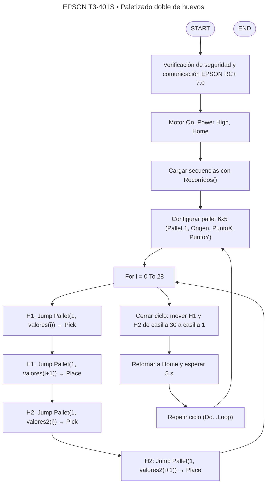

<div align="center">
  
</div>

---

# 🤖 robotic-EPSON — EPSON RC+ 7.0 · EPSON T3-401S

> **Resumen:** Práctica de laboratorio del curso *Robótica Industrial* orientada al análisis y operación del manipulador **EPSON T3-401S**, la comparación con los robots **Motoman MH6** y **ABB IRB 140**, y el desarrollo de una aplicación de paletizado de huevos basada en recorridos tipo *caballo* sobre una cubeta 6×5 usando **EPSON RC+ 7.0**.

---

## 🧾 Autores

- **Samuel David Sanchez Cardenas** — Desarrollo, simulación y documentación.  
  [](https://github.com/samsanchezcar)
- **Santiago Ávila** — Diseño de trayectorias, pruebas y documentación.  
  [](https://github.com/search?q=Santiago+Avila)

---

## 📂 Estructura del repositorio

```text
robotic-EPSON
├── Laboratorio_No__03____2025_II___Robótica_Industrial.pdf
├── position-generation.py
├── Epson-sim
│   ├── Main.prg           # Programa principal en SPEL+ (EPSON RC+ 7.0)
│   ├── Main.obj
│   ├── Lab_3.sprj /.wsp   # Proyecto y workspace EPSON RC+
│   ├── robot1.pts         # Puntos asociados al pallet
│   └── ...                # Archivos de configuración y etiquetas de I/O
└── sources
    ├── acople.png
    ├── AcopleTC.ipt
    ├── eggs-positions.png
    ├── epson-rc-interface.png
    └── montaje-huevos-caja-tool.jpeg
```

---

## 📋 Tabla de Contenidos

1. [Introducción](#introducción)  
2. [Objetivos](#objetivos)  
3. [Comparación técnica de manipuladores](#cuadro-comparativo-de-características-técnicas)  
4. [Configuraciones Home del EPSON T3-401S](#configuraciones-home-epson-t3-401s)  
5. [Procedimientos de operación manual](#procedimiento-detallado-para-movimientos-manuales)  
6. [Control de velocidad en modo manual](#explicación-niveles-de-velocidad-para-movimientos-manuales)  
7. [Software EPSON RC+ 7.0](#software-epson-rc-70)  
8. [Comparación EPSON RC+ 7.0 vs RoboDK vs RobotStudio](#comparación-epson-rc-70-vs-robodk-vs-robotstudio)  
9. [Diseño del gripper neumático por vacío](#diseño-del-gripper-neumático-por-vacío)  
10. [Desarrollo de la práctica: recorrido doble tipo “caballo”](#desarrollo-de-la-práctica-recorrido-doble-tipo-caballo)  
11. [Resultados](#resultados)  
12. [Conclusiones](#conclusiones)  
13. [Agradecimientos](#agradecimientos)  
14. [Referencias](#referencias)  

---

## 📖 Introducción

Los manipuladores industriales siguen siendo el núcleo de la automatización flexible en la industria moderna. En esta práctica se estudia el robot **EPSON T3-401S**, un SCARA compacto de 4 ejes, y se contrasta con dos manipuladores de seis grados de libertad ampliamente usados en el laboratorio: el **Motoman MH6** (Yaskawa) y el **ABB IRB 140**.

El laboratorio integra:

- Análisis comparativo de capacidades técnicas (carga, alcance, repetibilidad, velocidad).  
- Estudio de la posición **Home** y la jog operation del T3-401S.  
- Uso del entorno de programación **EPSON RC+ 7.0** para simulación y ejecución.  
- Diseño de un gripper neumático por vacío para manipulación segura de huevos de gallina.  
- Implementación de una trayectoria de **paletizado doble** sobre una cubeta 6×5 basada en recorridos tipo caballo, programada en **SPEL+**.

---

## 🎯 Objetivos

Tomados y adaptados del enunciado oficial del laboratorio:

- Comprender las características técnicas del **EPSON T3-401S** y compararlas con el **Motoman MH6** y el **ABB IRB 140**.  
- Identificar y describir la configuración inicial y la definición de la posición **Home** del EPSON T3-401S.  
- Realizar movimientos manuales del T3-401S en modos articular y cartesiano, incluyendo traslaciones y rotaciones en los ejes X, Y, Z.  
- Cambiar y controlar los niveles de velocidad en movimiento manual.  
- Describir las principales aplicaciones de **EPSON RC+ 7.0** y su comunicación con el manipulador.  
- Comparar EPSON RC+ 7.0 con **RoboDK** y **RobotStudio**.  
- Diseñar un **gripper neumático por vacío** para manipulación de huevos.  
- Diseñar y ejecutar una trayectoria en EPSON RC+ 7.0, y replicarla físicamente en el T3-401S.

---

## 📊 Cuadro comparativo de características técnicas

### Especificaciones relevantes

A partir de la documentación de los fabricantes y el enunciado del laboratorio:

| Característica                          | **EPSON T3-401S (SCARA)** | **Yaskawa Motoman MH6** | **ABB IRB 140** |
|-----------------------------------------|----------------------------|--------------------------|------------------|
| **Tipo de robot**                       | SCARA 4 ejes (R-R-P-R)     | Articulado 6 ejes        | Articulado 6 ejes |
| **Carga máxima (payload)**             | 3 kg máx.                  | 6 kg                     | 6 kg             |
| **Alcance / Longitud de brazo**        | 400 mm (225 + 175 mm)      | ≈ 1422 mm                | ≈ 810 mm         |
| **Grados de libertad**                 | 4                          | 6                        | 6                |
| **Repetibilidad típica**               | ±0,02 mm / ±0,02°          | ±0,08 mm                 | ±0,03 mm         |
| **Vel. máx. de ejes principales**      | J1–J2: 3700 mm/s, J4: 2600 °/s | Hasta 610 °/s según eje | 200–450 °/s según eje |
| **Peso del robot**                     | ~16 kg                     | ~130 kg                  | ~98 kg           |
| **Controlador típico**                 | Control integrado + EPSON RC+ 7.0 (PC) | DX100 (Yaskawa) | IRC5 (ABB)      |
| **Aplicaciones típicas**               | Pick & place, empaque, electrónica ligera, ensamble | Manipulación, soldadura ligera, dispensado | Soldadura por arco, pick & place, empaquetado |
| **Ventajas clave**                     | Bajo costo, compacto, fácil integración con EPSON RC+ | Gran alcance con baja carga propia | Alta precisión, buena rigidez |
| **Recomendado para**                   | Celdas compactas, manipulación ligera y rápida | Volúmenes de trabajo amplios | Aplicaciones de alta precisión en espacio reducido |

Los datos del T3-401S (alcance total 400 mm, carga máxima 3 kg y repetibilidad ±0,02 mm) se tomaron de las especificaciones oficiales del robot.

---

## 🏠 Configuraciones Home EPSON T3-401S

En el entorno EPSON RC+ 7.0, la posición **Home** del T3-401S se configura como una combinación definida de los cuatro ejes, que sirve como referencia segura para inicio y retorno de programas. Los manuales y el material de capacitación enfatizan:

- La necesidad de **definir correctamente Home** después de instalación o mantenimiento.  
- El uso del menú **HOME** en EPSON RC+ 7.0 para registrar y modificar las posiciones de referencia.  
- La relación entre las marcas físicas de calibración en el robot (puntos de referencia en las articulaciones) y la definición lógica en el software.

En la práctica, se usó una posición Home:

- Con el brazo extendido en dirección positiva del eje X de la base.  
- Altura suficiente para despejar la cubeta de huevos y el gripper.  
- Orientación del eje 4 alineada con el montaje del gripper.

Esta posición se utiliza como:

- **Punto de arranque** antes de iniciar el paletizado.  
- **Punto seguro de retorno** al finalizar cada ciclo completo del algoritmo `Paletizado_doble`.

---

## 🕹️ Procedimiento detallado para movimientos manuales

La operación manual del T3-401S se realiza desde el **Robot Manager** y las herramientas de **JOG & TEACH** en EPSON RC+ 7.0.

### 1. Preparación del sistema

1. Verificar área de trabajo libre (cubeta, mesa, mangueras neumáticas).  
2. Encender el controlador del T3-401S y el PC con EPSON RC+ 7.0.  
3. Establecer comunicación **PC ↔ Controlador** vía USB o Ethernet usando `Setup → PC to Controller Communications` y el botón **Connect**.  
4. Confirmar que no haya alarmas activas y que los **motores** puedan habilitarse (estado `MotorsOn`).  

### 2. Modos de operación manual (JOG)

EPSON RC+ soporta diferentes modos de Jogging:

#### 🔹 Modo por juntas (*Joint Jog*)

- Permite mover cada articulación (J1–J4) de forma independiente.  
- Se selecciona el modo **Joint** en la ventana de JOG & TEACH.  
- Las teclas de movimiento asocian pasos incrementales sobre cada eje, con señales visuales de los valores de ángulo y recorrido actuales.

#### 🔹 Modo cartesiano (*Linear / Cartesian Jog*)

- Permite desplazar el TCP en los ejes **X, Y, Z** y rotar alrededor de **Z**.  
- Se selecciona el sistema de coordenadas deseado:
  - **Base** (WORLD), relativo a la base del robot.  
  - **Tool** (TCP), relativo a la herramienta.  
- El operador puede alternar entre **Go / Move / Jump** en Robot Manager para probar movimientos puntuales, lineales o con elevación automática.

### 3. Registro de puntos

- Con el robot en el punto deseado, se registra la posición en la lista de puntos (`Teach Point`), asociada al archivo `robot1.pts`.  
- Estos puntos se usan posteriormente como referencias para el **pallet** definido en `Main.prg`.

---

## 🚦 Explicación niveles de velocidad para movimientos manuales

Los parámetros de **Speed** y **Accel** son programables entre 1 y 100 % para movimientos punto a punto (PTP).

En Jog & Teach, EPSON RC+ 7.0 expone estos parámetros como:

- **Jog Speed** (porcentaje de la velocidad máxima de PTP).  
- Parámetros de aceleración asociados (**Accel**).  

### Cambio de nivel de velocidad

1. Abrir la ventana **JOG & TEACH**.  
2. Ajustar el deslizador de **Speed** o seleccionar el valor deseado (por ejemplo 10 %, 30 %, 50 %…).  
3. Observar en pantalla el valor numérico de velocidad configurado.  
4. Ejecutar el movimiento manteniendo pulsado el botón de habilitación (Deadman) y la tecla de dirección correspondiente.

En la práctica:

- Para aproximaciones finas sobre los huevos se usaron velocidades bajas (≈10–20 %).  
- Para los desplazamientos entre casillas de la cubeta se emplearon valores medios (≈40–60 %).  

---

## 💻 Software EPSON RC+ 7.0

### Funcionalidades principales

EPSON RC+ 7.0 es el entorno de desarrollo y simulación para robots EPSON, con las siguientes características:

- **Entorno de desarrollo** con editor de programas en **SPEL+**, compilador y ventana de ejecución.  
- **Simulador 3D** integrado para robots SCARA y 6-Axis (configuración de robot virtual, herramientas, objetos y propiedades).  
- **Robot Manager** para operación segura, panel de control, monitorización de I/O y carga de proyectos.  
- Comunicación **USB 2.0 o Ethernet** con el controlador del T3.  
- Gestión de **E/S estándar, remota y de mano (Hand I/O)** para conectar sensores y actuadores (gripper neumático).  

### Comunicación EPSON RC+ ↔ Manipulador

- EPSON RC+ actúa como **HMI / IDE**, donde se editan y cargan programas hacia el controlador integrado del T3.  
- La comunicación se establece mediante:
  - **USB (PC Development Port)** para programación directa.  
  - **Ethernet** cuando el controlador está en red.  
- Una vez conectado, el software permite:
  - Descarga y ejecución de programas (`Main.prg`).  
  - Lectura y escritura de señales digitales (por ejemplo, `Out_9` para la pinza).  

En resumen, **EPSON RC+ 7.0** genera y envía instrucciones en **SPEL+** al controlador, el cual resuelve la cinemática, planifica la trayectoria (PTP/CP) y genera órdenes de servo a cada articulación para mover físicamente el manipulador.

---

## 🧠 Comparación EPSON RC+ 7.0 vs RoboDK vs RobotStudio

| Aspecto                 | **EPSON RC+ 7.0**                          | **RoboDK**                                   | **RobotStudio**                                      |
|-------------------------|--------------------------------------------|----------------------------------------------|------------------------------------------------------|
| **Marca objetivo**      | Solo robots EPSON                          | Multi-marca (incluye ABB, Yaskawa, etc.)     | Solo robots ABB                                      |
| **Lenguaje principal**  | SPEL+                                      | API (Python, etc.) + generadores de código   | RAPID (nativo ABB)                                   |
| **Simulación**          | Simulador integrado, centrado en EPSON    | Simulación 3D genérica multi-robot           | Simulación con Virtual Controller muy precisa        |
| **Post-procesamiento**  | Nativo EPSON                               | Post-procesadores para muchos fabricantes    | Nativo ABB                                           |
| **Curva de aprendizaje**| Baja–media para tareas típicas SCARA      | Media                                         | Más empinada, pero muy potente                      |
| **Aplicaciones típicas**| Celdas compactas, pick & place, T-series   | Entornos heterogéneos con múltiples robots   | Programación avanzada de celdas ABB                 |

**Interpretación personal:**

- **EPSON RC+ 7.0** es la herramienta ideal cuando se trabaja exclusivamente con robots EPSON: sencilla para tareas de paletizado, pick & place y manipulación ligera.  
- **RoboDK** es la navaja suiza multi-marca: excelente para prototipado rápido y entornos con varios fabricantes.  
- **RobotStudio** es el estándar de oro para celdas ABB donde se requiere máxima fidelidad entre simulación y realidad, gracias al controlador virtual y a sus herramientas de integración.

---

## 🧲 Diseño del gripper neumático por vacío

La tarea requiere diseñar un gripper neumático capaz de levantar huevos de forma segura utilizando las entradas y salidas digitales del T3-401S.

### Elementos clave

- **Ventosa** compatible con superficies curvas de huevo.  
- **Válvula neumática** (solenoide) controlada mediante una salida digital estándar (por ejemplo `Out_9`) desde el Hand I/O o E/S estándar.  
- **Tubos neumáticos** aprovechando los canales integrados en el brazo (2×ø6 mm y 1×ø4 mm).  
- **Soporte mecánico** (ver `acople.png` y `AcopleTC.ipt`) fijado al flange del eje 4.

### Lógica eléctrica / de control

Se adopta una **lógica negada** para la salida que controla la válvula:

```spel
Function Grip_On       ' activar pinza (lógica NEGATIVA: activo = nivel bajo)
    Off Out_9
Fend

Function Grip_Off      ' desactivar pinza (lógica NEGATIVA: inactivo = nivel alto)
    On Out_9
Fend
```

De esta forma, el estado seguro por defecto es **pinza desactivada** (`Grip_Off`), y solo cuando se requiere vacío se fuerza `Off Out_9` para energizar la válvula (según el cableado elegido).

---

## 🔧 Desarrollo de la práctica: recorrido doble tipo “caballo”

La práctica implementa un **paletizado doble** de huevos en una cubeta de **6×5 (30 casillas)**, con dos huevos H1 y H2 que se desplazan siguiendo recorridos tipo **caballo de ajedrez** (movimientos en L).

### 1. Generación de recorridos (position-generation.py)

El script `position-generation.py` calcula dos recorridos de 30 casillas cada uno:

- Tablero 5×6 (`ROWS = 5`, `COLS = 6`).  
- H1 inicia en la esquina superior derecha (casilla 1) y H2 en la esquina inferior izquierda (casilla 30).  
- Cada movimiento es un salto de caballo (±2,±1 / ±1,±2).  
- Se usa una heurística tipo **Warnsdorff** para minimizar bloqueos: se priorizan las casillas con menor número de movimientos posteriores posibles.  

El algoritmo:

- Mantiene dos tableros de visitados (`board_h1`, `board_h2`).  
- Alterna turnos entre H1 y H2 (`turn = 1` o `2`).  
- Evita que ambos huevos ocupen la misma casilla simultáneamente (`other_pos`).  
- Cuando ambos alcanzan 30 casillas visitadas se considera solución completa.

Al final, el script imprime las tablas de pasos para cada huevo y se convierten a secuencias de índices (1..30) que se transfieren a los arreglos `valores()` y `valores2()` utilizados en SPEL+.

### 2. Programa principal en SPEL+ (Main.prg)

El corazón de la lógica está en `Epson-sim/Main.prg`:

#### Variables globales

```spel
Global Integer valores(30)
Global Integer valores2(30)
Global Integer i
```

- `valores`: orden de casillas para el huevo 1 (H1).  
- `valores2`: orden de casillas para el huevo 2 (H2).  

#### Función `main`

```spel
Function main
    Motor On
    Power High
    Accel 100, 100
    Speed 100
    Grip_Off()
    Home

    Call Recorridos

    Do
        Call Paletizado_doble
    Loop
Fend
```

- Enciende motores y pone **Power High**.  
- Llama a `Recorridos` para cargar los arreglos con la secuencia precalculada.  
- Ejecuta indefinidamente el ciclo `Paletizado_doble`.

#### Definición del pallet

Dentro de `Paletizado_doble` se declara:

```spel
Pallet 1, Origen, PuntoX, PuntoY, 6, 5
```

- `Pallet 1` crea un pallet de ID 1 con 6 columnas × 5 filas (30 posiciones).  
- `Origen`, `PuntoX` y `PuntoY` son puntos enseñados que definen la esquina de referencia y los vectores de desplazamiento entre casillas.  

#### Ciclo principal de paletizado

Para cada índice `i` de 0 a 28:

1. **Objeto 1 (H1)**:  
   - Ir a casilla de recogida `valores(i)`.  
   - Bajar en Z (`Move Here +Z(-7.5)`), cerrar pinza (`Grip_On`), y subir.  
   - Ir a casilla de depósito `valores(i+1)` y soltar (`Grip_Off`).  

2. **Objeto 2 (H2)**:  
   - Misma lógica usando `valores2(i)` y `valores2(i+1)`.

Al finalizar el `For`, se realiza un **cierre de ciclo**:

- H1: mover de la casilla 30 (`valores(29)`) de vuelta a la casilla 1 (`valores(0)`).  
- H2: mover de la casilla 30 (`valores2(29)`) a la casilla 1 (`valores2(0)`).

Con esto se crea un recorrido **cíclico**: tras un ciclo completo, ambos huevos regresan a sus posiciones originales, listos para repetir el proceso.

---

## 📈 Diagrama de flujo



---

## 📊 Resultados

### Simulación en EPSON RC+ 7.0

<div align="center">

<!-- TODO: reemplazar VIDEO_ID_SIM por el ID real de YouTube -->
[](https://youtu.be/VIDEO_ID_SIM)

**(Enlace pendiente)** — Simulación del paletizado doble de huevos en EPSON RC+ 7.0.

</div>

Características observadas:

- Trayectoria libre de colisiones con la cubeta y el entorno.  
- Movimientos suaves al aproximarse a los huevos (baja velocidad en Z).  
- Validación de la lógica de secuencias `valores()` y `valores2()` sobre el pallet virtual.

### Implementación física en el EPSON T3-401S

<div align="center">

<!-- TODO: reemplazar VIDEO_ID_REAL por el ID real de YouTube -->
[](https://youtu.be/VIDEO_ID_REAL)

**(Enlace pendiente)** — Ejecución real del paletizado con huevos y gripper neumático.

</div>

Resultados:

- Manipulación **estable** de los huevos sin deslizamientos apreciables.  
- No se presentaron caídas de huevos durante el ciclo completo.  
- La trayectoria calculada por el algoritmo de caballos se respetó en el robot real.  

---

## 🎓 Conclusiones

1. **Comparación técnica:** El EPSON T3-401S, a pesar de su menor alcance y carga respecto al MH6 y al IRB 140, ofrece una repetibilidad muy alta (±0,02 mm) y un diseño compacto ideal para tareas de pick & place de alta velocidad en espacios reducidos.  

2. **Configuración Home:** La correcta definición de la posición Home en EPSON RC+ 7.0 es fundamental para garantizar ciclos seguros y repetibles, y se apoya en las marcas de calibración físicas del robot.  

3. **Movimientos manuales y velocidad:** Los modos de Jog (joint y cartesiano) y el ajuste de velocidad porcentual permiten una operación manual intuitiva: lento para aproximaciones delicadas y rápido para traslados largos, manteniendo siempre la seguridad del operador y de la pieza.  

4. **EPSON RC+ 7.0 como herramienta:** El entorno combina de forma integrada programación, simulación y gestión de I/O, simplificando enormemente el flujo de trabajo desde la idea hasta la ejecución en el T3-401S, especialmente para aplicaciones de paletizado.  

5. **Comparación de software:** RobotStudio sigue siendo la referencia para celdas ABB complejas, mientras que RoboDK ofrece versatilidad multi-marca. EPSON RC+ 7.0, por su parte, destaca por su sencillez y enfoque práctico cuando el sistema está centrado exclusivamente en robots EPSON.  

6. **Algoritmo de caballos:** El uso combinado de Python para la generación de recorridos tipo caballo y SPEL+ para la implementación en el robot demuestra la importancia de integrar herramientas de alto nivel con los lenguajes específicos de los controladores industriales.

7. **Diseño del gripper:** La implementación de un gripper neumático por vacío, apoyado en las I/O estándar y de mano del T3, permitió manipular objetos frágiles (huevos) de forma segura, validando el diseño mecánico y la lógica de control invertida de la salida `Out_9`.  

---

## 🤝 Agradecimientos

Queremos agradecer de manera especial a nuestro monitor **Johan López Arias** por su paciencia, apoyo constante y ayuda durante el desarrollo del laboratorio. Sus explicaciones sobre EPSON RC+ 7.0, la configuración del T3-401S y las buenas prácticas de seguridad fueron clave para completar con éxito esta práctica.

---

## 📚 Referencias

1. Laboratorio No. 03 - Robótica Industrial - Análisis y Operación del Manipulador EPSON T3-401S. Universidad Nacional de Colombia, 2025.  
2. EPSON T3-401S Robot Manual. Especificaciones, rangos de movimiento y configuración de sistema.  
3. Capacitación básica EPSON RC+ 7.0 – Robots SCARA Serie T. Presentación de entrenamiento y guía de simulador, Robot Manager y JOG & TEACH.  
4. Manual del operador RobotStudio. ABB Robotics.  
5. Manual IRB 140 / Manual general de RAPID. ABB Robotics.  
6. infoPLC – Programación Básica DX100. Yaskawa Motoman.  

---

<div align="center">
  
</div>
